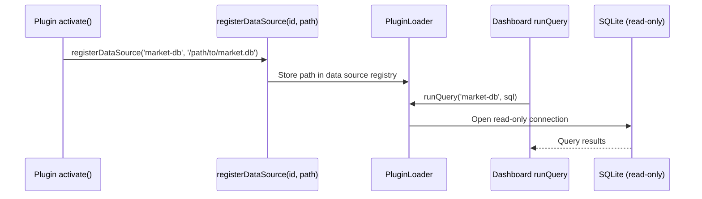

## Task

Register a SQLite database from a [plugin](../../getting-started/glossary.md#plugin) and declare widget templates so the dashboard can query the data and render pre-built panels.

## Result

A read-only data source visible in the dashboard's "Add widget" gallery, with pre-built SQL widgets that users can add in one click.

## Prereqs

- A working plugin with `activate()` exported (see [Create a plugin](./create-a-plugin.md)).
- A SQLite database file your plugin manages.
- Ethos dashboard running (`ethos dashboard` or the web UI).

## Steps

### 1. Register the data source in `activate()`

Call `api.registerDataSource()` with a unique id and the absolute path to your SQLite database.

```typescript
import type { EthosPluginApi } from '@ethosagent/plugin-sdk';
import { join } from 'node:path';

export function activate(api: EthosPluginApi) {
  const dbPath = join(api.dataDir, 'market.db');
  api.registerDataSource('market-db', dbPath);
}
```

The id (`market-db`) is the handle that widget templates and dashboard queries use to reference this database. It must be unique across all loaded plugins.

### 2. Create `widgets.yaml`

Place a `widgets.yaml` file in your plugin's root directory. Each entry declares a pre-built widget template.

```yaml
- id: daily-volume
  title: Daily Trading Volume
  queryType: sql
  dataSource: market-db
  sql: "SELECT date, SUM(volume) as total FROM trades GROUP BY date ORDER BY date DESC LIMIT 30"
  description: "30-day trading volume trend"
```

The `dataSource` field must match the id you passed to `registerDataSource()`.

### 3. Understand widget template fields

| Field | Required | Description |
|---|---|---|
| `id` | yes | Unique identifier for this widget template. |
| `title` | yes | Display name shown in the widget gallery. |
| `queryType` | yes | `sql` for raw SQL queries, or `agent-prompt` for natural-language queries routed through the agent. |
| `dataSource` | yes | The id passed to `registerDataSource()`. |
| `sql` | when `queryType: sql` | The SQL query to execute. Must be read-only. |
| `description` | no | Short description shown in the gallery below the title. |

You can declare multiple widgets in a single `widgets.yaml`. Each one appears as a separate entry in the gallery.

```yaml
- id: daily-volume
  title: Daily Trading Volume
  queryType: sql
  dataSource: market-db
  sql: "SELECT date, SUM(volume) as total FROM trades GROUP BY date ORDER BY date DESC LIMIT 30"
  description: "30-day trading volume trend"

- id: top-movers
  title: Top Movers
  queryType: sql
  dataSource: market-db
  sql: "SELECT symbol, pct_change FROM daily_stats ORDER BY ABS(pct_change) DESC LIMIT 10"
  description: "Stocks with the largest absolute percentage change today"

- id: market-summary
  title: Market Summary
  queryType: agent-prompt
  dataSource: market-db
  description: "Ask the agent to summarize today's market activity"
```

### 4. Understand read-only enforcement

All queries run against a read-only SQLite connection. The dashboard rejects any SQL statement that would mutate data.

Blocked statements include `INSERT`, `UPDATE`, `DELETE`, `DROP`, `ALTER`, `CREATE`, and `ATTACH`. If a query contains any of these, the dashboard returns a `READONLY_QUERY_ONLY` error and does not execute the statement.

This is enforced at the connection level — the SQLite file is opened with `SQLITE_OPEN_READONLY`. There is no way for a widget query to write to your database.

### 5. Understand the data flow

The following diagram shows how data flows from plugin registration through to a rendered dashboard widget.



The [plugin](../../getting-started/glossary.md#plugin) owns the database file and writes to it however it needs. The dashboard only reads from it through the read-only connection.

### 6. Build and install

```bash
pnpm build && ethos plugin install .
```

The plugin loader reads `widgets.yaml` during installation and registers the templates.

## Verify

1. Run `ethos plugin list` — confirm your plugin shows a data-source count.
2. Open the dashboard and click "Add widget."
3. Your widget templates appear in the gallery with their titles and descriptions.
4. Click a template — it creates a panel pre-filled with the SQL query and connected to your data source.
5. The panel renders query results immediately.

## Troubleshoot

| Symptom | Cause | Fix |
|---|---|---|
| Data source not listed | `registerDataSource()` not called in `activate()`. | Confirm the call runs during activation. Check `ethos plugin list`. |
| `READONLY_QUERY_ONLY` error | SQL contains a mutating statement. | Rewrite the query using only `SELECT`. |
| Widget missing from gallery | `dataSource` in `widgets.yaml` does not match the registered id. | Ensure the id strings match exactly. |
| `Database not found` | Path passed to `registerDataSource()` does not exist. | Use an absolute path. Verify the file exists before registration. |
| Empty query results | Database exists but the table is empty or the table name is wrong. | Open the database with `sqlite3` and verify the schema and row count. |
| `widgets.yaml` ignored | File is not in the plugin root directory. | Move it next to `package.json`. |

## See also

- [Create a plugin](./create-a-plugin.md)
- [Add a panel](./add-a-panel.md)
- [Plugin SDK reference](../reference/plugin-sdk.md)
- [Storage interface](../reference/storage-interface.md)
