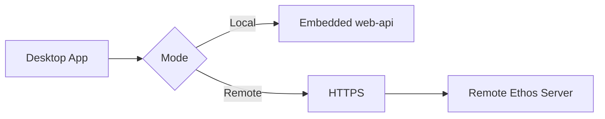

The Ethos desktop app is an Electron shell that provides a native Mac, Windows, and Linux interface with the same [agent](../getting-started/glossary.md#agent) capabilities as the CLI and web dashboard. It runs in local mode (embedded server) or remote mode (connected to an external Ethos instance).

## Overview {#overview}

The desktop app wraps the Ethos web UI in a native window. It provides:

- Full agent chat with streaming responses and [tool](../getting-started/glossary.md#tool) events
- Settings panel for [personality](../getting-started/glossary.md#personality), MCP server, and connection management
- Local mode with an embedded `web-api` process (no separate server required)
- Remote mode connecting to any running Ethos server instance
- Status bar indicator showing connection state

All [sessions](../getting-started/glossary.md#session) and [memory](../getting-started/glossary.md#memory) use the same `~/.ethos/` directory as the CLI.

## Installation {#installation}

Download the installer for your platform from the releases page.

| Platform | Format | Notes |
|---|---|---|
| macOS | `.dmg` | Universal binary (Intel + Apple Silicon). Drag to `/Applications`. |
| Windows | `.exe` installer | Standard Windows installer. Adds a Start Menu entry. |
| Linux | `.AppImage`, `.deb` | AppImage is portable; `.deb` integrates with apt. |

## Local mode {#local-mode}

Local mode is the default. The app starts an embedded `web-api` process, equivalent to running `ethos serve --web` from the CLI. No separate server installation is required.

Sessions are stored in `~/.ethos/` — the same directory the CLI uses. Switching between the desktop app and `ethos chat` from the same working directory shares conversation history through the standard [session](../getting-started/glossary.md#session) keying model.

## Remote mode {#remote-mode}

Connect to a remote Ethos server instead of running locally. The connection target is any running `ethos serve --web` or `ethos run-all` instance — a VPS, home server, or team deployment.

Configure the connection:

1. Open **Settings** → **Connection**.
2. Select **Remote**.
3. Enter the server URL and auth token.
4. Select **Test Connection** to verify.
5. Select **Save**.

```
┌─────────────────────────────────────┐
│  Connection Settings                │
├─────────────────────────────────────┤
│                                     │
│  Mode:  ○ Local   ● Remote          │
│                                     │
│  Server URL                         │
│  ┌─────────────────────────────────┐│
│  │ https://ethos.example.com       ││
│  └─────────────────────────────────┘│
│                                     │
│  Auth Token                         │
│  ┌─────────────────────────────────┐│
│  │ ••••••••••••••••••••            ││
│  └─────────────────────────────────┘│
│  Stored in OS keychain              │
│                                     │
│  [ Test Connection ]  [ Save ]      │
│                                     │
│  Status: ● Connected (142ms)        │
│                                     │
└─────────────────────────────────────┘
```

## Security {#security}

The auth token is stored in the OS keychain via Electron `safeStorage`. It is never written to config files or stored on disk in plaintext.

| Concern | Handling |
|---|---|
| Token storage | OS keychain (`safeStorage`) — encrypted at rest by the OS |
| Transport | HTTPS recommended for all remote connections |
| Token transmission | Sent only over the configured connection — not logged, not included in crash reports |

## Status bar indicator {#status-bar}

The status bar shows the current connection state.

| Indicator | Meaning |
|---|---|
| Green dot — "Local" | Running the embedded `web-api` process |
| Blue dot — "Remote: *hostname*" | Connected to a remote server |
| Red dot — "Disconnected" | Connection lost; the app is attempting to reconnect |

## Switching between local and remote {#switching-modes}

Open **Settings** → **Connection** and toggle between **Local** and **Remote**. Switching modes restarts the agent [session](../getting-started/glossary.md#session).



## See also {#see-also}

- [CLI platform](cli.md) — the terminal surface that shares the same `~/.ethos/` state directory.
- [Configure providers](../using/how-to/configure-providers.md) — provider chain and key rotation shared across all surfaces.
- [Glossary](../getting-started/glossary.md) — [`session`](../getting-started/glossary.md#session), [`personality`](../getting-started/glossary.md#personality), [`agent`](../getting-started/glossary.md#agent).
