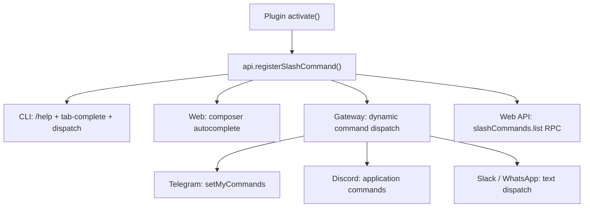

## Context {#context}

A [plugin](../../getting-started/glossary.md#plugin) in Ethos can expose slash commands to users. The interesting part is not that plugins have commands — every framework does that. The interesting part is where those commands appear: everywhere. CLI, web dashboard, Telegram, Discord, Slack, WhatsApp, web API. The plugin author writes one handler. The framework handles the rest.

This matters because the alternative is what every other multi-surface agent framework does: the plugin imports platform SDKs, registers commands per surface, and maintains six divergent code paths for one piece of functionality. That model breaks the moment someone adds a seventh surface.

This page explains how one `api.registerSlashCommand()` call reaches every surface, what architectural choices make that possible, and what the approach trades away.

## Discussion {#discussion}

### What plugin commands are {#what-plugin-commands-are}

A plugin command is a function registered once in the plugin's `activate()` call. The [PluginLoader](../../getting-started/glossary.md#plugin) collects all registrations at startup and maintains a `SlashCommandRegistry`. Every surface — CLI, web, messaging gateways, API — queries that registry at runtime to discover available commands.

The plugin author never imports a Telegram SDK, never calls Discord's application command API, never wires a Slack event listener. The registration is surface-agnostic. The framework adapters translate it into whatever the platform expects.

### How they work {#how-they-work}

In the plugin's `activate()` function:

```typescript
export function activate(api: PluginAPI) {
  api.registerSlashCommand({
    name: 'market brief',
    description: 'Show today\'s market summary',
    handler: async (args, ctx) => {
      // fetch and return market data
    },
  });
}
```

The `PluginLoader` collects all registered commands at startup. Each surface queries the registry at runtime to discover available commands. The handler receives a surface-agnostic `ctx` — the same function runs regardless of whether the user typed the command in a terminal or a Telegram chat.

### Where they appear {#where-they-appear}

| Surface | How commands appear | Discovery |
|---|---|---|
| CLI | Listed in `/help` with `[plugin]` tag, tab-completable | Immediate — commands register at startup |
| Web dashboard | Composer autocomplete when typing `/` | Immediate |
| Telegram | Registered via `setMyCommands` for the command menu | On gateway start |
| Discord | Registered as application commands | On gateway start |
| Slack | Text-based dispatch (no native command registration) | On message |
| WhatsApp | Text-based dispatch | On message |
| Web API | Available via `slashCommands.list` RPC | On request |

Discovery timing varies by surface. CLI and web have the registry in-process, so commands appear the moment the plugin loads. Gateway-backed surfaces (Telegram, Discord) register commands with the platform API at startup — a brief delay, but still automatic. Slack and WhatsApp do not have native command registration, so the gateway dispatches on message text.

### The architecture {#architecture}



The key architectural decision: commands register with the framework, not with individual surfaces. The `PluginLoader` maintains a `SlashCommandRegistry` that surfaces query at runtime. A plugin author never imports a Telegram or Discord SDK — the gateway adapter handles platform-specific registration.

This is the same inversion that makes [personalities](../../getting-started/glossary.md#personality) work across surfaces. The personality does not know it is running on Telegram. The command does not know it is running on Telegram. The adapter knows, and the adapter translates.

## Trade-offs {#trade-offs}

Single registration is simpler for plugin authors but means commands cannot have platform-specific behavior. A command cannot render a Telegram inline keyboard or a Discord embed directly. Platform-specific UI affordances live in the adapter layer, not the command handler. If you need rich platform UI, the adapter is where to put it — the command returns structured data, and the adapter decides how to render it.

Text-based dispatch on Slack and WhatsApp means no native autocomplete. Users must know the command name or type `/help` to discover available commands. This is a real usability gap compared to Telegram's command menu or Discord's application command picker.

The handler receives a surface-agnostic `ctx` — it cannot branch on "am I running in Telegram?" by design. This is intentional: surface-conditional logic in handlers would recreate the per-platform code paths the architecture eliminates. If a command genuinely needs platform-specific output formatting, the `ctx.surface` field is available to detect the surface type. Use it sparingly — every surface branch is a maintenance burden the single-registration model was meant to avoid.

## See also {#see-also}

- [CLI platform](../../platforms/cli.md) — where plugin commands appear as `/help` entries
- [Telegram adapter](../../platforms/telegram.md) — gateway-side command registration
- [Glossary](../../getting-started/glossary.md) — [plugin](../../getting-started/glossary.md#plugin)
