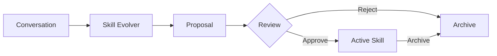

## Task

Review, approve, prune, and archive [skill](../../getting-started/glossary.md#skill) proposals that Ethos generates from your usage patterns.

## Result

Your `~/.ethos/skills/` directory contains only the evolved skills you explicitly approved. Stale proposals are pruned. Retired skills are archived and recoverable.

## Prereqs

- `ethos` installed and a provider configured ([Configure an LLM provider](configure-providers.md)).
- At least one [personality](../../getting-started/glossary.md#personality) with `skill_evolution.enabled: true` in its `config.yaml`.
- Several completed [sessions](../../getting-started/glossary.md#session) with enough [tool](../../getting-started/glossary.md#tool) calls to trigger the evolver (default threshold: 5 tool calls per session).

## How skill evolution works

After each conversation with enough tool calls, the skill evolver analyzes your usage patterns and proposes new skills. Proposals land in `~/.ethos/skills/pending/` as markdown files with YAML frontmatter. They stay there until you approve, reject, or prune them.



Enable skill evolution per-personality in `~/.ethos/personalities/<id>/config.yaml`:

```yaml
skill_evolution.enabled: true
skill_evolution.min_tool_calls: 5
skill_evolution.cooldown_minutes: 60
```

| Config key | Type | Default | Effect |
|---|---|---|---|
| `skill_evolution.enabled` | `boolean` | `false` | Enables the evolver for this personality |
| `skill_evolution.min_tool_calls` | `integer` | `5` | Minimum tool calls in a session before the evolver runs |
| `skill_evolution.cooldown_minutes` | `integer` | `60` | Minimum minutes between evolver runs for the same personality |

## Steps

### 1. View pending proposals

```bash
ethos evolve status
```

Output lists each proposal with its name, source personality, creation date, and a summary of the detected pattern:

```text
Pending proposals (3):
  summarize-pr    from engineer   2026-06-07  "Summarizes GitHub PR diffs with key changes"
  lint-fix-loop   from engineer   2026-06-08  "Runs lint, applies fixes, re-checks in a loop"
  draft-reply     from writer     2026-06-09  "Drafts email replies matching prior tone"
```

### 2. Inspect a proposal

Open the proposal file to review the generated skill definition before approving:

```bash
cat ~/.ethos/skills/pending/summarize-pr.md
```

The file contains a standard skill markdown with YAML frontmatter (`name`, `description`) and the skill body. Verify the instructions match the pattern you want to codify.

### 3. Approve a proposal

```bash
ethos evolve apply summarize-pr.md
```

The CLI moves the file from `~/.ethos/skills/pending/summarize-pr.md` to `~/.ethos/skills/summarize-pr/SKILL.md` and registers it. The skill is available on the next chat turn.

To approve all pending proposals at once:

```bash
ethos evolve apply --all
```

### 4. Reject a proposal

Delete the proposal file directly:

```bash
rm ~/.ethos/skills/pending/draft-reply.md
```

Or use the prune command with a filter (see step 5).

### 5. Prune old proposals

Remove proposals older than a threshold:

```bash
ethos evolve prune --older-than 7
```

This deletes all pending proposals created more than 7 days ago. Add `--yes` to skip the confirmation prompt:

```bash
ethos evolve prune --older-than 7 --yes
```

Without `--older-than`, prune removes all pending proposals:

```bash
ethos evolve prune --yes
```

### 6. Archive active skills

Move active skills that have not been invoked recently to `~/.ethos/skills/archived/`:

```bash
ethos evolve archive --older-than 30
```

This archives evolved skills with no invocations in the last 30 days. Archived skills are not loaded at boot but remain on disk for recovery.

To restore an archived skill:

```bash
mv ~/.ethos/skills/archived/summarize-pr ~/.ethos/skills/summarize-pr
```

### 7. Manage proposals in the web UI

Start the web dashboard:

```bash
ethos serve --web
```

The status bar shows a badge with the count of pending proposals. Click it to open the approve/reject panel.

Each proposal row displays:

- Skill name and description
- Source personality
- Creation date
- **Approve** and **Reject** buttons

Click **Approve** to move the proposal to active skills. Click **Reject** to delete it. Both actions take effect immediately.

### 8. Configure via the personality wizard

Run the setup wizard:

```bash
ethos personality create <id>
```

The wizard includes a **Skill Learning** step with:

- A toggle to enable or disable skill evolution for this personality.
- A threshold field for `min_tool_calls` (how many tool calls trigger the evolver).
- A cooldown field for `cooldown_minutes` (minimum interval between evolver runs).

For existing personalities, re-run the wizard:

```bash
ethos personality edit <id>
```

The **Skill Learning** step appears with the current values pre-filled.

## Verify

Confirm that approved skills appear in the active skill list:

```bash
ethos skills list
```

The approved skill shows under the `ethos` source label. Start a chat session and invoke it:

```bash
ethos chat
```

```text
/summarize-pr
```

The agent responds using the evolved skill's instructions.

Confirm archived skills no longer load:

```bash
ethos skills list | grep summarize-pr
```

No output means the skill is archived and not active.

## Troubleshoot

**No proposals appear after many sessions.** -- Verify the personality has `skill_evolution.enabled: true` in its `config.yaml`. Check that sessions exceed the `min_tool_calls` threshold. Check that the cooldown period has elapsed since the last evolver run.

**`ethos evolve apply` fails with "file not found".** -- Pass the filename with the `.md` extension: `ethos evolve apply summarize-pr.md`, not `ethos evolve apply summarize-pr`.

**Approved skill does not appear in chat.** -- The active personality's `toolset.yaml` may filter it out. Run `/skills` inside chat to see which skills the personality loads. Add the skill's `required_tools` to the personality's toolset if needed.

**Evolver proposes duplicate skills.** -- The evolver dedupes by skill name. If a skill with the same name already exists in `~/.ethos/skills/`, the proposal is skipped. If you see near-duplicates with different names, reject the redundant one and keep the more general version.

**Archive restored skill not loading.** -- Move the directory back to `~/.ethos/skills/`, not `~/.ethos/skills/pending/`. The scanner expects `~/.ethos/skills/<name>/SKILL.md`, not a flat markdown file.

**Web UI badge count stuck.** -- Refresh the browser. The badge polls `~/.ethos/skills/pending/` on a 30-second interval. If the count persists after refresh, check that the pending directory exists and is readable.
