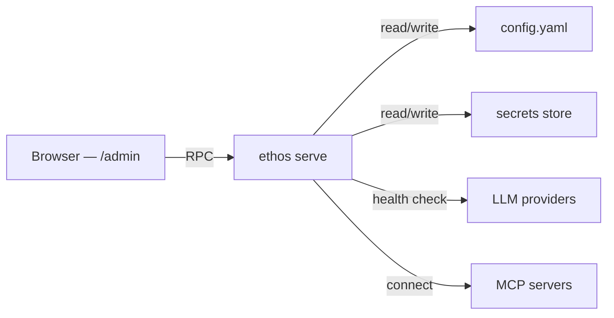

## Task

Manage [channel adapters](../../getting-started/glossary.md#channel-adapter), API keys, and MCP servers from the admin panel instead of editing config files by hand.

## Result

A running admin panel at `http://localhost:3000/admin` where you can view channel status, copy webhook URLs, rotate provider API keys, and add or remove MCP servers — all protected by bearer token auth.

## Prereqs

- `ethos` installed and a provider configured ([Configure an LLM provider](configure-providers.md)).
- A bearer token set in `~/.ethos/config.yaml` under `auth.bearerToken`.
- A modern browser (Chrome, Firefox, Safari, Edge).

## Steps

### 1. Start the admin panel

```bash
ethos serve --web
```

The web server starts on port 3000 by default. Navigate to `http://localhost:3000/admin` in your browser.

To use a different port:

```bash
ethos serve --web --port 8080
```

The admin panel shares the same auth as the rest of the API. Include the bearer token in the `Authorization` header for programmatic access, or enter it in the login prompt when the browser redirects.

### 2. Understand the architecture

The admin panel is a thin web UI that calls RPC endpoints on the `ethos serve` process. All mutations write to `~/.ethos/config.yaml` or the secrets store.



No state lives in the browser. Every change persists immediately to disk.

### 3. Manage channels

Click the **Channels** tab. The table shows one row per configured [channel adapter](../../getting-started/glossary.md#channel-adapter).

| Column | Content |
|---|---|
| **Channel** | Adapter name (e.g. `telegram`, `slack`, `discord`). |
| **Status** | `connected`, `disconnected`, or `error`. |
| **Webhook URL** | The inbound webhook endpoint for this channel. |
| **Last event** | Timestamp of the most recent inbound message. |

**Copy a webhook URL.** Click the copy icon next to the URL. Paste it into your platform's webhook configuration (e.g. Telegram's `setWebhook`, Slack's Event Subscriptions URL).

**Check channel health.** A green dot means the adapter is connected and polling or listening. A red dot means the adapter failed to start — hover for the error message.

### 4. Rotate API keys

Click the **API Keys** tab. Each row represents a configured [LLM provider](../../getting-started/glossary.md#llm-provider).

| Column | Content |
|---|---|
| **Provider** | Provider name (e.g. `anthropic`, `openai`, `openrouter`). |
| **Status** | `healthy` or `unreachable`. |
| **Key hint** | Last four characters of the active API key. |
| **Last checked** | Timestamp of the most recent health check. |

**Run a health check.** Click **Check** next to a provider. The panel sends a lightweight API call and reports success or the error code.

**Rotate a key.** Click **Rotate** next to the provider. Paste the new API key into the input field and click **Save**. The panel writes the key to the [secrets](../../getting-started/glossary.md#secret) store and re-runs the health check. The old key is overwritten immediately — there is no rollback.

```bash
# Verify the new key works from the CLI
ethos provider check anthropic
```

### 5. Add an MCP server

Click the **MCP** tab. The table lists all registered MCP servers.

| Column | Content |
|---|---|
| **Server** | Server name or URL. |
| **Transport** | `stdio` or `sse`. |
| **Status** | `connected` or `disconnected`. |
| **Personalities** | Which [personalities](../../getting-started/glossary.md#personality) have access. |

**Add a server.** Click **Add MCP Server**. Fill in the required fields:

| Field | Description | Example |
|---|---|---|
| **Name** | Human-readable label. | `linear` |
| **URL or command** | Server endpoint (SSE) or command (stdio). | `https://mcp.linear.app` or `npx @linear/mcp-server` |
| **Transport** | `stdio` or `sse`. | `sse` |
| **Headers** | Optional auth headers (bearer token servers). | `Authorization: Bearer sk-...` |

Click **Save**. The panel writes the entry to `~/.ethos/config.yaml` under `mcp.servers` and attempts a connection. The status column updates to `connected` on success.

**Remove a server.** Click the trash icon next to the server row. Confirm the deletion. The entry is removed from `config.yaml` immediately.

### 6. Secure access

The admin panel is protected by the same bearer token auth as the Ethos API. Three rules:

1. **Set a strong token.** Generate one with `openssl rand -hex 32` and store it in `~/.ethos/config.yaml`:

   ```yaml
   auth:
     bearerToken: "your-64-char-hex-token"
   ```

2. **Do not expose the port.** Bind to `localhost` only (the default). For remote access, use an SSH tunnel:

   ```bash
   ssh -L 3000:localhost:3000 user@remote-host
   ```

3. **Use a reverse proxy in production.** Place nginx or Caddy in front with TLS termination. See [Deploy in production](deploy-in-production.md) for the full setup.

## Verify

Open `http://localhost:3000/admin` in your browser. Confirm:

- The **Channels** tab shows your configured adapters with status indicators.
- The **API Keys** tab shows your providers. Click **Check** on one — it reports `healthy`.
- The **MCP** tab lists any registered servers with `connected` status.

From a separate terminal, verify the bearer token is enforced:

```bash
# Should return 401 Unauthorized
curl -s -o /dev/null -w "%{http_code}" http://localhost:3000/admin/api/channels

# Should return 200
curl -s -o /dev/null -w "%{http_code}" \
  -H "Authorization: Bearer your-token" \
  http://localhost:3000/admin/api/channels
```

## Troubleshoot

**Admin panel returns 401** — The bearer token is missing or wrong. Check `~/.ethos/config.yaml` under `auth.bearerToken`. Re-enter the token in the browser login prompt.

**Channels tab shows "error" for an adapter** — The adapter failed to connect. Hover over the red status dot for the error message. Common causes: expired bot token, incorrect webhook URL, network firewall blocking outbound connections.

**Provider health check fails** — The API key is invalid or the provider is down. Click **Rotate** to enter a new key. Verify independently:

```bash
ethos provider check anthropic
```

**MCP server stuck on "disconnected"** — The server process is not running or the URL is unreachable. For stdio servers, verify the command runs locally:

```bash
npx @linear/mcp-server --help
```

For SSE servers, verify the endpoint responds:

```bash
curl -I https://mcp.linear.app
```

**Changes in the admin panel don't appear in CLI** — Both read from the same `~/.ethos/config.yaml`. Changes apply immediately. If they don't, restart `ethos serve --web` to clear any cached state.

## See also

- [Use the web dashboard](use-web-dashboard.md) — the full dashboard for managing personalities, memory, and cron jobs.
- [Configure an LLM provider](configure-providers.md) — set up provider API keys from the CLI.
- [Set up MCP for a personality](set-up-mcp-for-a-personality.md) — detailed MCP server configuration for both web and CLI.
- [Deploy in production](deploy-in-production.md) — reverse proxy, TLS, and PM2 setup for remote access.
